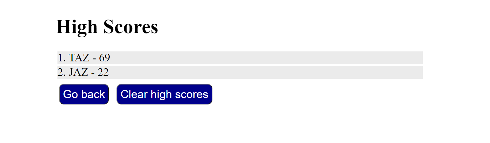

# Javascript Code Quiz

Online basic javascript quiz that will keep track of highscores that are submitted. The user is given the choice to skip submitting a score if they wish through the skip button.

## Changes to original design

Removed elements on pages where they might get in the way or break something. 

For example: 
* Removed the view highscore link from all pages except the intro page to prevent losing time on the quiz or missing submitting your score by accident.

* Removed timer on any pages that didn't have a question on it, as it would be useless on those pages.

## Site Images

## Webpage Link
https://tzeuch0922.github.io/js-code-quiz/